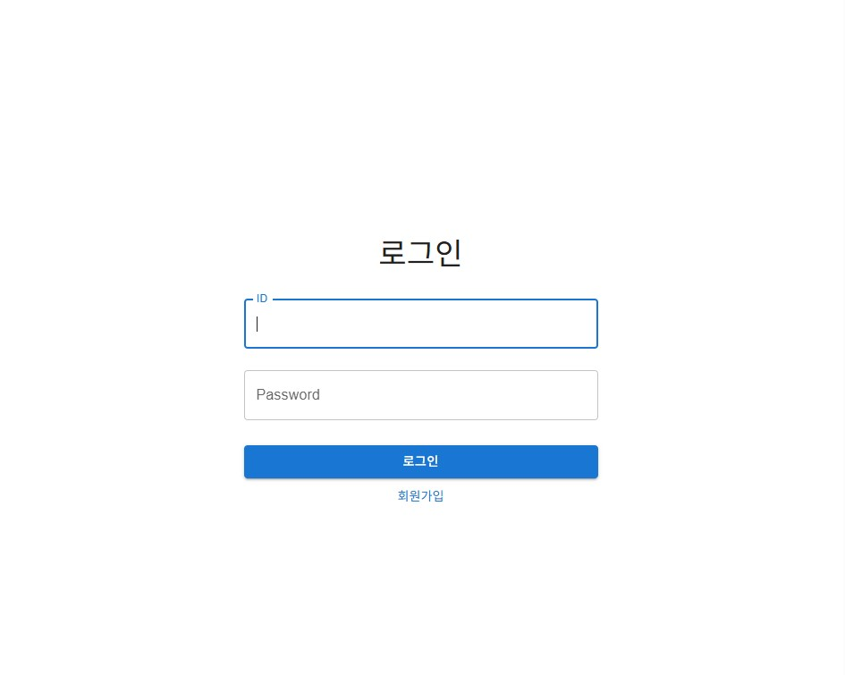

# SNS
> 부담없는 소통

## 📌프로젝트 소개

+ X(구 트위터) 스타일의 SNS 웹 애플리케이션입니다.
+ 부담없이 채팅과 피드로 소통하는 플랫폼이 목적입니다.
+ React + MUI 기반의 프론트엔드와 Node.js + Express + MySQL 백엔드로 구현되었습니다.

## 📅개발기간

2025.11.25 ~ 2025.12.03

## 🎯기획 배경

부담 없이, 익명으로 자유롭게 소통하는 sns를 만들어보고 싶어서 제작하게 되었습니다.

## 🚀주요 기능

+ 회원가입 / 로그인 (JWT 인증)
++  

    
  

  
+ 실시간 채팅
+ 게시글 작성
+ 댓글 / 대댓글 작성

## 🛠사용기술

### front

+ react
+ mui
+ react router

  
### back

+ node.js / express
+ jwt

  
### db

+ mysql

## 💬프로젝트 후기
+ JWT를 이용해 로그인 유지 처리를 직접 경험하며 인증 구조를 익힐 수 있었다.
+ 평소 구상하던 것을 실제로 만들 수 있었던 경험이여서 매우 좋았다.
+ 최초 구상했던 것보다 부족한 기능이 많아서 많이 아쉽다.

